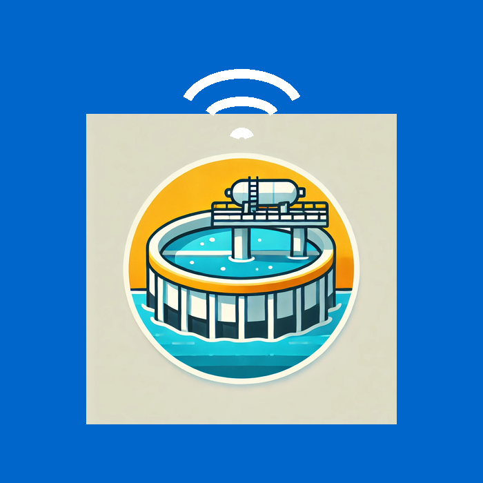
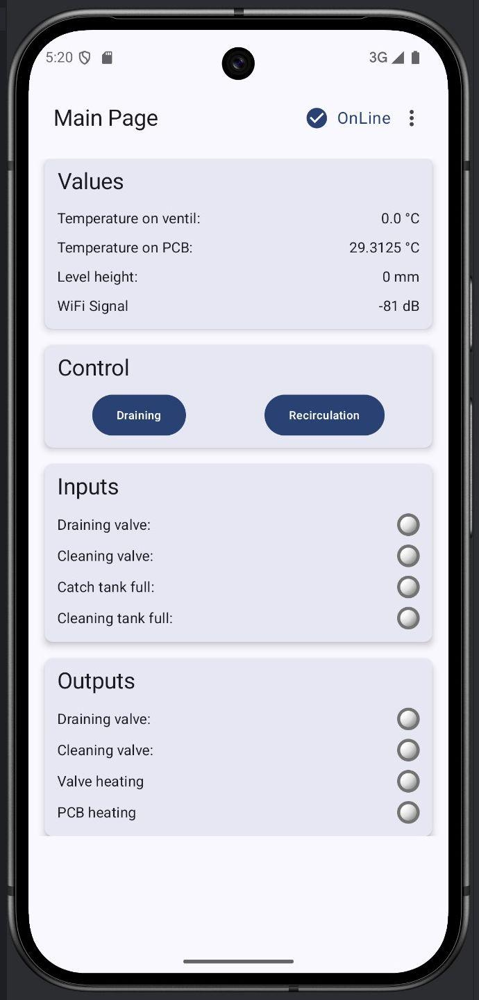
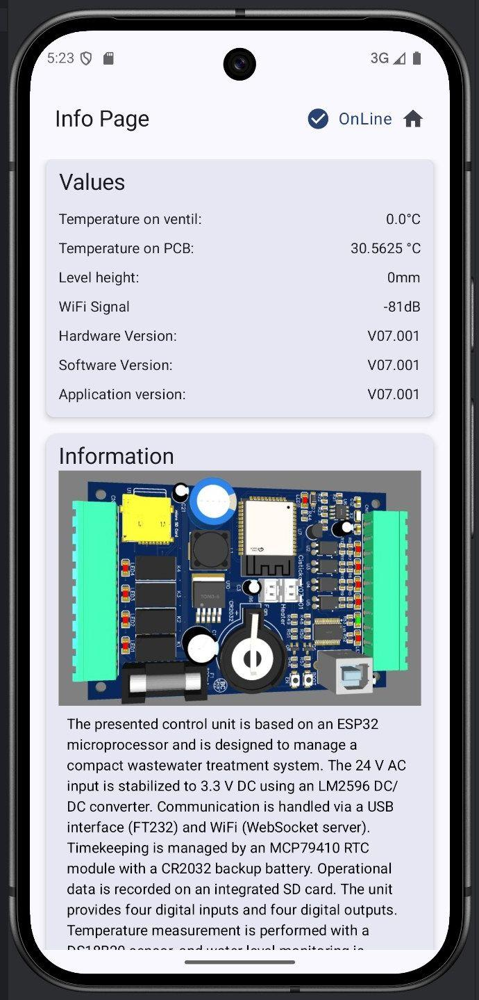
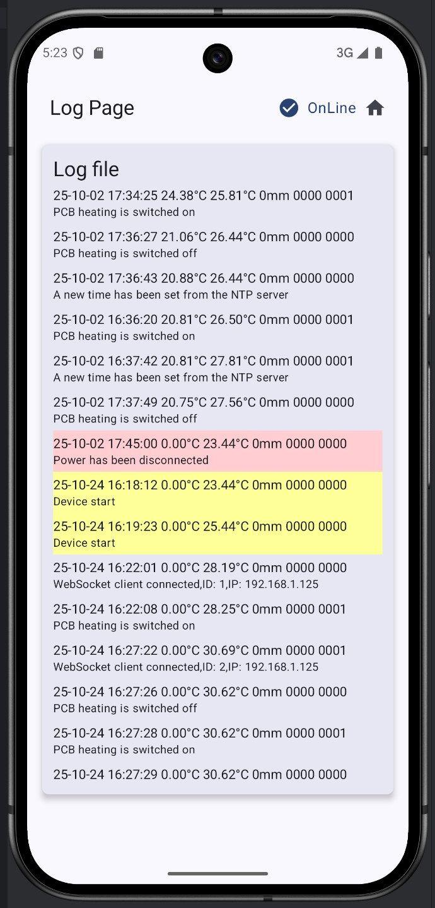
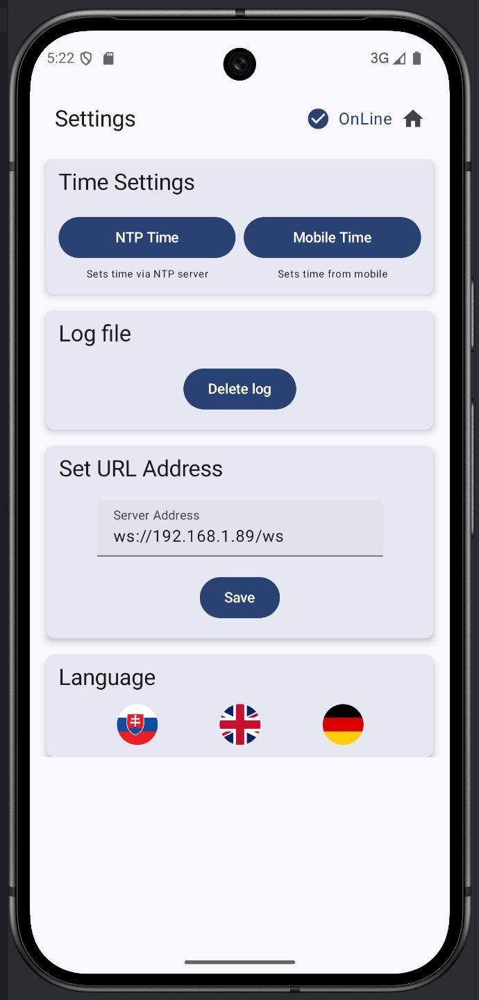
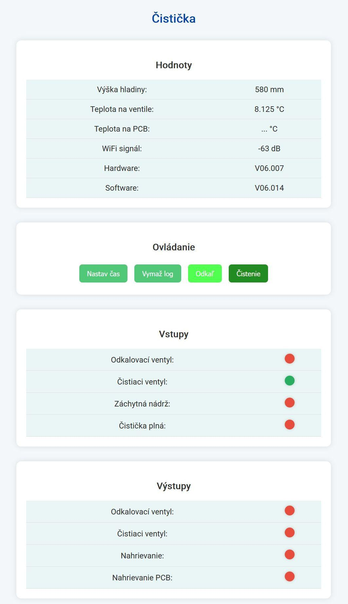
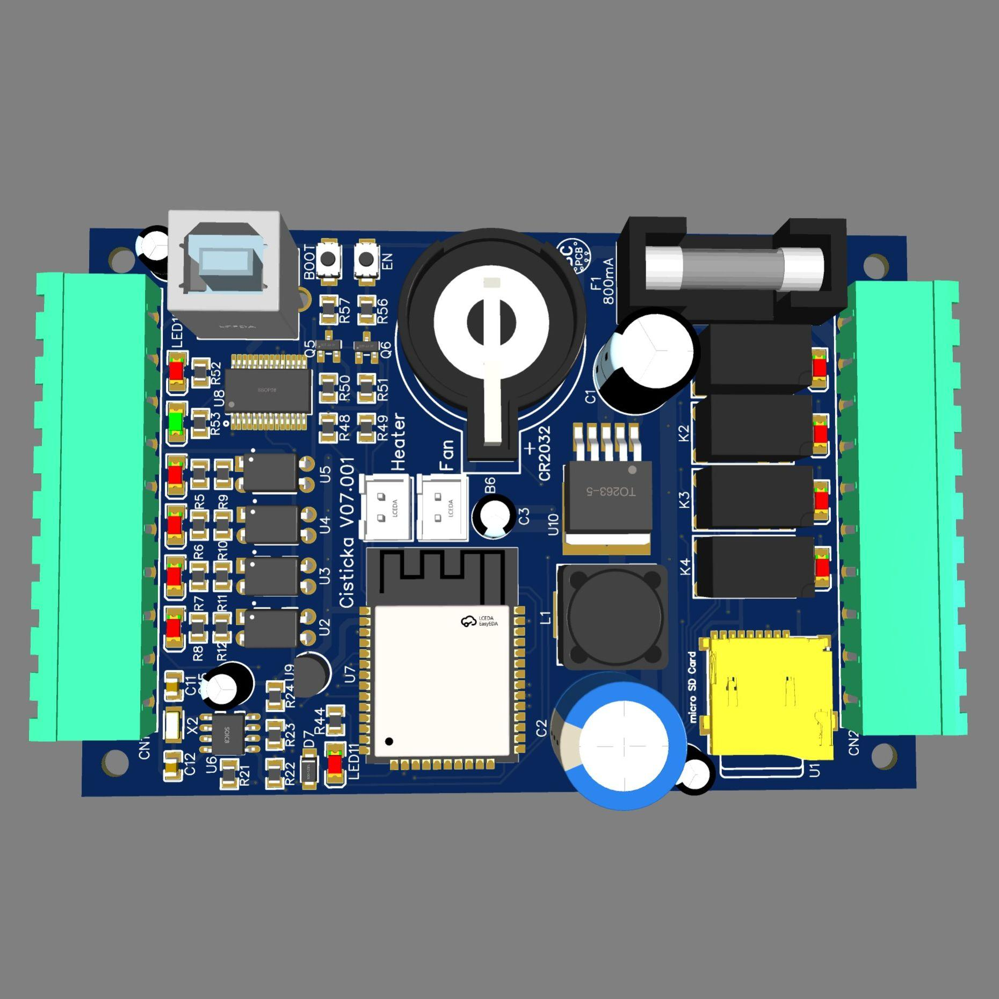

<p align="center">
  
</p>

<h1 align="center">ESP32 Wastewater Treatment Controller</h1>
<p align="center">
Smart ESP32-based controller for compact wastewater treatment systems.<br>
WebSocket • Android App • WiFi • SD Logging • PCB & Web UI
</p>

---

## 📌 Project Overview

This project implements a smart control unit for a compact **wastewater treatment system** using an **ESP32** microcontroller.  
The controller automates draining, recirculation, temperature control, and system safety while logging operational data to SD card.

It can be fully controlled using:
- ✅ Android mobile application (WebSocket client)
- ✅ Integrated ESP32 Webpage (stored in SPIFFS)

PCB & schematic:  
🔗 https://oshwlab.com/bobobo007/cisticka-_v06-001

---

## ✨ Features

| Category | Details |
|---------|---------|
| Connectivity | WiFi + WebSocket Server |
| Sensors | Valve temp + PCB temp + water level |
| Control | Cleaning / Recirculation + drain valve |
| RTC | MCP79410 + CR2032 backup battery |
| I/O | 4 inputs + 4 outputs |
| Data Logging | microSD card (FatFS) |
| Local UI | Webpage hosted on ESP32 |
| Mobile UI | Android application |

---

## 📱 Android Application UI

<p align="center">
    
    
  
</p>

<p align="center">
  
</p>

---

## 🖥 Web User Interface

<p align="center">
  
</p>

---

## 🧠 Hardware Architecture

| Component | Description |
|----------|-------------|
| MCU | ESP32 |
| Power | 24V AC → LM2596 → 3.3V DC |
| RTC | MCP79410 |
| USB Interface | FT232 |
| Storage | microSD |
| Temp Sensors | DS18B20 (x2) |
| Level Sensor | EARU pressure measurement |
| IO | 4 inputs, 4 outputs |

PCB Rendering:

<p align="center">
  
</p>

---

## 🔌 WebSocket Commands

### Client → Server

| Command | Purpose | Example |
|--------|---------|---------|
| `hb` | Heartbeat | `{"com":"hb"}` |
| `gv` | Get values | `{"com":"gv","sta":true}` |
| `cl` | Cleaning / Recirculation | `{"com":"cl","sta":true}` |
| `dr` | Drain valve open | `{"com":"dr","sta":true}` |
| `st` | Set time from phone | `{"com":"st","time":"yyyy-MM-dd'T'HH:mm:ssXXX"}` |
| `nt` | Sync NTP time | `{"com":"nt","sta":true}` |
| `sl` | Send log file | `{"com":"sl","sta":true}` |
| `dl` | Delete log file | `{"com":"dl","sta":true}` |
| `ou` | Set output state | `{"com":"ou1","sta":true}` |

---

### Server → Client

Example:

```json
{
 "so":"V07.001","ha":"V07.001",
 "te":23.25,"tp":30.8125,"de":0,"wi":-88,
 "cl":false,"fl":false,
 "ip":[false,false,false,false],
 "ou":[false,false,false,false]
}
